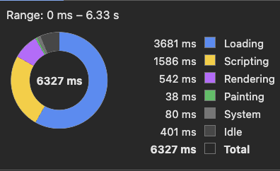
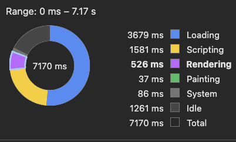

# Modern CSS @2024-10-18

This document is based on [the 2024 baseline page](https://web.dev/baseline/2024). Baseline is a set of features which are implemented in all major browsers: Chrome, Edge, Firefox, and Safari.

## [content-visibility](https://developer.mozilla.org/en-US/docs/Web/CSS/content-visibility)

This allows to save browser rendering of certain elements. The elements are still present in the DOM, so search works, but performance can be improved.
Use `auto` to let the browser handle rendering decision.

In dmn-js, adding CSS rule below allows to shave 100ms (~20%) of rendering time for a decision table with 1000 rules:

```css
tr,
td {
  content-visibility: auto;
}
```

Before:



After:



However, most of the work is done in Inferno on scripting.
Also, setting the CSS as above results in a jumping scrollbar as you can see in the capture: [scroll-jump.mov](./content-visibility/scroll-jump.mov).

I tried to reduce the scroll jump via simple heuristic: each row is two-lines of text high unless otherwise measured. This can be done via [contain-intrinsic-block-size](https://developer.mozilla.org/en-US/docs/Web/CSS/contain-intrinsic-block-size)

```css
tr,
td {
  content-visibility: auto;
  contain-intrinsic-block-size: auto 2em;
}
```

However, this didn't help for scroll-jump. Same for `auto 28px` and `contain-intrinsic-height`.

## [:user-valid](https://developer.mozilla.org/en-US/docs/Web/CSS/:user-valid), [:user-invalid](https://developer.mozilla.org/en-US/docs/Web/CSS/:user-invalid) pseudo-classes

This allows to reduce JavaScript as we can let the browser track user's interaction with the inputs and decide when invalid state should be displayed. We don't need to check whether input was _touched_ anymore.

As with all form-related CSS pseudoclasses, we need to [use the platform for validation](https://developer.mozilla.org/en-US/docs/Web/HTML/Constraint_validation), either via attributes, or through the imperative `setCustomValidity` method. The latter is required to implement custom validation logic.

See also: https://web.dev/articles/user-valid-and-user-invalid-pseudo-classes

([demo](./user-valid/index.html))

## [align-content](https://developer.mozilla.org/en-US/docs/Web/CSS/align-content)

This is how you center content vertically in 2024:

```css
.container {
  align-content: center;
}
```

No more need for flexbox or grid.

([demo](./align-content/index.html))

## [container queries](https://developer.mozilla.org/en-US/docs/Web/CSS/@container)

In responsive design, we use `@media` query to detect browser's properties like viewport size to adjust the website style.
Container queries are the same but for elements. For example, you can define element's style based on its size.
Check out the documentation for more info.

Notice also that `style` query is experimental so NOT in the baseline.

[demo](./container-queries/index.html)

## [subgrid](https://web.dev/articles/css-subgrid)

This allows to reuse grid configuration in other elements than direct children.
I tried to use it for the welcome tab, but then noticed that we can allow to disable some of the groups so grid is perhaps not the best approach.

## out of scope

`gap` is useful in grid and flexbox. No need for dummy divs, cf. https://github.com/camunda/camunda-modeler/pull/4621
`clamp(min, value, max)` is a useful CSS function for cases like above.

Private filesystem sounds exciting: https://web.dev/articles/origin-private-file-system
It's no CSS though.